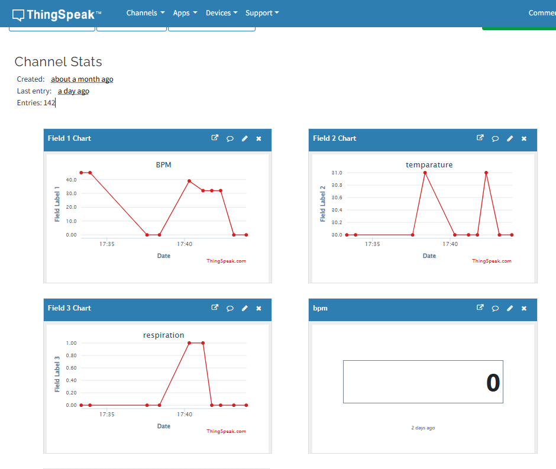
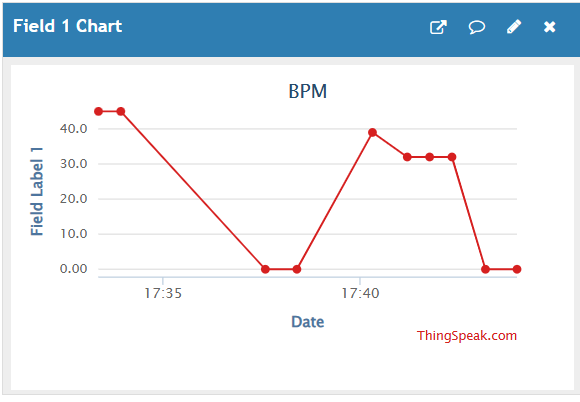

# SEPSISGUARD - IoT-Enabled Real-Time Sepsis Alert System

## Project Overview

Sepsis is a life-threatening condition that arises when the body's response to an infection causes widespread inflammation, leading to tissue damage and organ failure. The current healthcare systems lack effective techniques for real-time monitoring and forecasting of sepsis development. The IoT-enabled system **SepsisGuard** addresses this gap by linking wearable sensors to the cloud, followed by machine learning (ML) models that continuously monitor critical values like heart rate, temperature, and respiration.

**SepsisGuard** is an IoT-based real-time health monitoring system designed to detect and alert hospital medical support staff about sepsis cases early. 
This system features:
- Wearable IoT devices (Arduino-based sensors) that continuously track vital signs and patient data.
- A Python-based ML model running on a local system with serial communication.
- A ThingSpeak cloud platform to assess the risk of sepsis using a Random Forest Machine Learning model.


---

## Features

- Real-time data acquisition via IoT sensors.
- Live monitoring dashboards on ThingSpeak.
- Random Forest ML model with 93.5% accuracy.
- Real-time alerts for abnormal vital signs.

---

## Requirements

- Python 3.x  
- Arduino IDE  
- Required Python libraries listed in `Model\requirements.txt`

---

## How to Run

1. Upload `Arduino\sepsis_alert_system.txt` to your Arduino.
2. Install Python dependencies:
   ```bash
   pip install -r Model\requirements.txt


## Installation

1. **Clone the repository**:
   ```bash
   git clone https://github.com/yourusername/SEPSISGUARD.git
   cd SEPSISGUARD

2. **Install dependencies**:
    - It is recommended to create a virtual environment before installing the dependencies.
    pip install -r model/requirements.txt

3. **Set up Arduino**:
    - Open the sepsis_alert_system.ino file in the Arduino IDE.
    - Select the correct board and port.
    - Upload the code to your Arduino board.

3. **Create ThingSpeak Account** : 
    - Visit official ThingSpeak website and create a new account.
    - Create a channel with the project name.
    - In API section you will find API keys which would be used in future.

3. **Run the ML model**:  
    - Ensure the dataset is present in dataset/data.xlsx.
    - Replace the placeholder API key in model/sepsis_ml_model.py with your actual 
        THINGSPEAK_API_KEY = "YOUR_ACTUAL_API_KEY"
    - Run the sepsis_ml_model.py script to start monitoring and predicting sepsis risk.
    - This script will read data via serial from Arduino, use the ML model to predict      sepsis risk, and upload sensor data to ThingSpeak.

4. **Monitor live data on your ThingSpeak channel** :
    - Login tou your ThingSpeak account and visit your project channel to monitor your reading continuosly.

5. **Sample Output Visuals** : <br>
- **ThingSpeak dashboard snapshot** : <br>
    
- **BPM over time graph** : <br>
    
- **Temperature levels graph** : <br>
    

6. **Usage**: 
    - The system reads data from the Arduino sensors and makes predictions using the trained Random Forest models.
    - Real-time data is uploaded to the ThingSpeak platform for monitoring.
    - Alerts are generated based on the predictions and can be sent to medical staff.

## License
For academic and testing purposes only.

## Contact
For any inquiries, please contact:<br>
**Varshith Jakkula**<br>
**Email:** 21r21a6690@gmail.com <br>
**LinkedIn:** https://www.linkedin.com/in/varshith-jakkula-34145a273